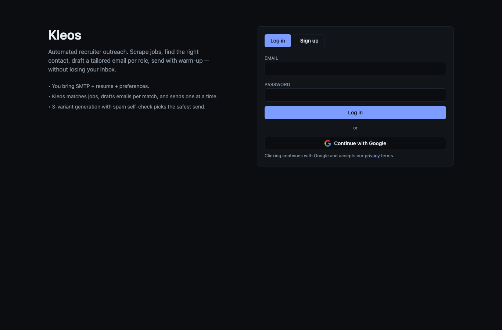

<div align="center">

# Kleos

**Privacy-first job-outreach platform — run recruiter outreach from your own email.**

[](https://abhiyadav.in/kleos/)
[](https://github.com/abhinav-yadav-official/Kleos/releases)
[](LICENSE)
[](go.mod)

</div>



## Overview

Kleos is a public-signup SaaS for structured, privacy-first job outreach. You connect your **own** SMTP sender, upload a resume, and set search preferences; Kleos helps you discover roles, draft a tailored email per role, and send one at a time with deliverability protection — without handing your inbox to a third party.

## Features

- **Own-inbox sending** — connect your SMTP credentials (stored AES-GCM encrypted at rest); mail goes out as you.
- **Resume management** — upload PDF, automatic text extraction, activation, listing, deletion.
- **Search preferences** — store and full-replace targeting preferences.
- **Tailored email drafting** — generates three email variants per role and runs a spam self-check to pick the safest send (see [Concepts](#concepts)).
- **Inbox warm-up** — gradual send ramp to protect sender reputation.
- **Accounts** — email/password + Google sign-in, JWT sessions with grace-window secret rotation.
- **Health dashboard** — read-only progress + health view.

## Live Access

| Surface | URL |
|---|---|
| App | https://abhiyadav.in/kleos/ |
| API base | https://abhiyadav.in/kleos/api/ |

## Installation

Prereqs: Go 1.23+, Docker, PostgreSQL.

```sh
git clone https://github.com/abhinav-yadav-official/Kleos.git
cd Kleos
cp .env.example .env        # fill secrets (JWT, encryption key, DB)
make                        # build / run targets — see Makefile
```

Production runs via Docker Compose (`deploy/docker-compose.yml`) behind an Nginx `/kleos/` subpath, with `scripts/backup.sh` for Postgres dumps.

## Usage

1. Sign up / log in (email or Google).
2. Connect and verify your SMTP sender.
3. Upload and activate a resume.
4. Set search preferences.
5. Review drafted variants per role and send.

## Concepts

- **Three-variant generation + spam self-check** — for each role Kleos drafts three candidate emails, scores each against common spam-trigger heuristics, and surfaces the lowest-risk variant so outreach lands in the inbox rather than spam.
- **Inbox warm-up** — newly connected senders have no reputation; sending at full volume immediately gets flagged. Warm-up ramps daily volume slowly so mailbox providers learn the sender is legitimate, raising long-term deliverability.

## License

[MIT](LICENSE) © 2026 Abhinav Yadav
